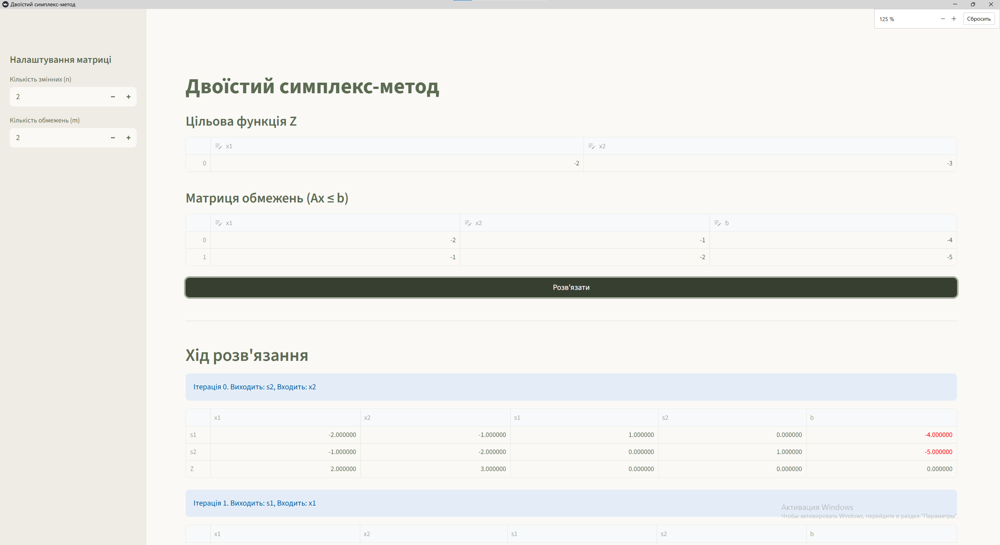
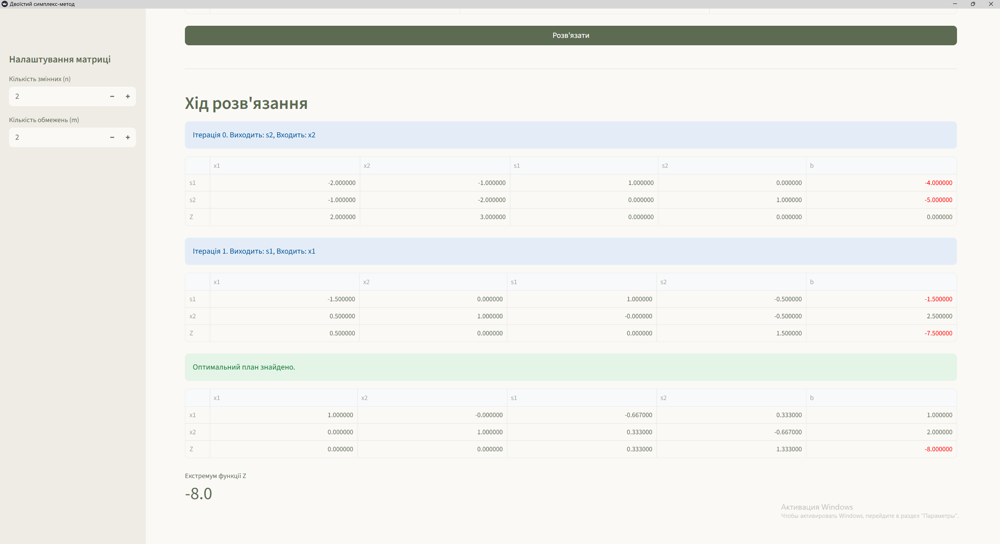

# Двоїстий симплекс-метод

Веб-додаток для покрокового розв'язання задач лінійного програмування за допомогою двоїстого симплекс-методу.

## Демонстрація роботи

 

## Структура проєкту

core/ - математичне ядро алгоритму
ui/ - шар представлення та інтерфейс користувача
.streamlit/ - конфігурація дизайну

## Запуск локально

pip install -r requirements.txt
python -m streamlit run ui/app.py

## Запуск через Docker

docker-compose up --build -d

Програма буде доступна за адресою http://localhost:8501